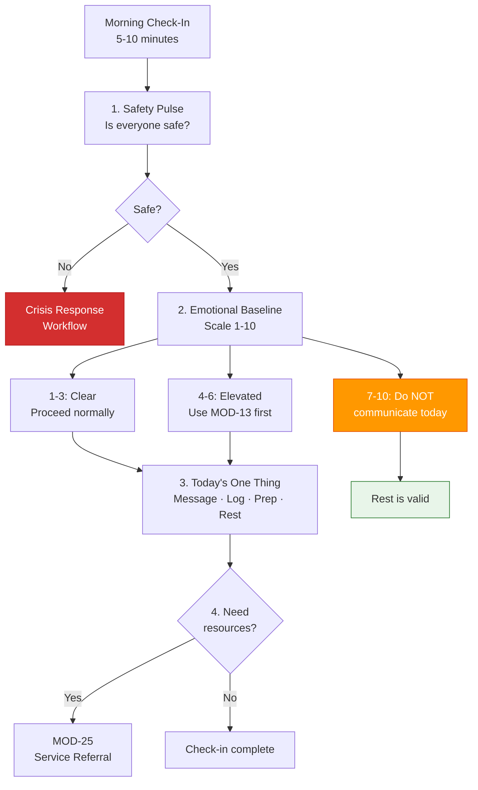
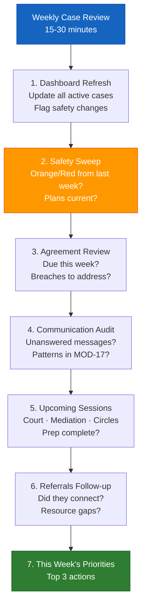
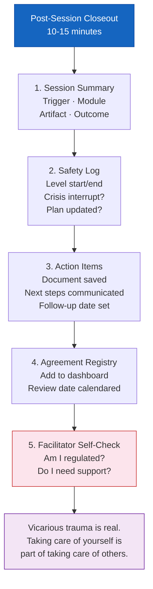

# Daily Check-In Routine
## Schedule: Daily (for active conflict situations) or as needed
## Time required: 5–10 minutes

---

### Morning Check-In (for individuals in active conflict)

**1. Safety pulse:** Is everyone safe today? (yes / no — if no, go to crisis response workflow)

**2. Emotional baseline:** On a scale of 1–10, how activated am I right now?
- 1–3: Clear to engage. Proceed normally.
- 4–6: Elevated. Use regulation tools (MOD-13) before any difficult communication.
- 7–10: Do not send messages or have difficult conversations. Stabilize first.

**3. Today's one thing:** What is the one conflict-related task I can realistically do today?
- [ ] Send a message (draft with MOD-01 first)
- [ ] Add a log entry (MOD-17 or MOD-20)
- [ ] Prepare for an upcoming meeting/hearing (MOD-09 or MOD-18)
- [ ] Rest and do nothing conflict-related today *(this is valid and sometimes the right choice)*

**4. Resource check:** Do I need anything today that I don't have access to?
- [ ] Attorney or advocate
- [ ] Mediator
- [ ] Mental health support
- [ ] Basic needs
→ If yes: MOD-25 (service referral)

---

# Weekly Case Review Routine
## Schedule: Weekly (Monday or first workday)
## Roles: MED, ATT, SWK, SCL, NCM, GAL — professional users
## Time required: 15–30 minutes

---

### Case Review Steps

**1. Dashboard refresh**
- Open peace-dashboard.md
- Update status on all active cases
- Flag any cases where safety level has changed

**2. Safety sweep**
- Any Orange/Red cases from last week?
- Safety plans in place? Current?
- Any cases needing safety check before proceeding?

**3. Agreement review**
- Any agreements due for review this week?
- Any reported breaches to address?

**4. Communication log audit** (co-parenting cases)
- Any unanswered communications from last week?
- Any pattern worth noting in MOD-17?

**5. Upcoming hearings / sessions**
- Any court dates, mediation sessions, or circles this week?
- Prep complete? (MOD-09, MOD-18, MOD-11 as applicable)

**6. Referrals follow-up**
- Any referrals made last week — did the person connect?
- Any open resource gaps?

**7. This week's priorities:**
| Priority | Case ID | Action | Due |
|---------|---------|--------|-----|
| 1 | | | |
| 2 | | | |
| 3 | | | |

---

# Post-Session Closeout Routine
## Schedule: Within 2 hours of each session
## Roles: All professional users (MED, ATT, SCL, SWK, RPF, NCM)
## Time required: 10–15 minutes

---

### Closeout Steps

**1. Session summary** (MOD-20 or session notes)
- What was the trigger?
- What module was used?
- What artifact was produced?
- What was the outcome?

**2. Safety log**
- Safety level at start: ___
- Safety level at end: ___
- Any crisis interrupt? (yes / no)
- Safety plan updated? (yes / no / not applicable)

**3. Action items captured**
- [ ] Document produced and saved
- [ ] Next steps communicated to client/participant
- [ ] Follow-up date set

**4. Agreement registry updated** (if agreement reached)
- Add to artifacts/peace-dashboard.md → Agreements section
- Review date calendared

**5. Facilitator self-check** *(often skipped — don't skip it)*
- Am I regulated after this session?
- Did anything in this session affect me personally?
- Do I need supervision, consultation, or a break before the next session?

> *Vicarious trauma is real. Conflict work is emotionally demanding.
> Taking care of yourself is part of taking care of others.*

**6. Session closed:** [date / time]
