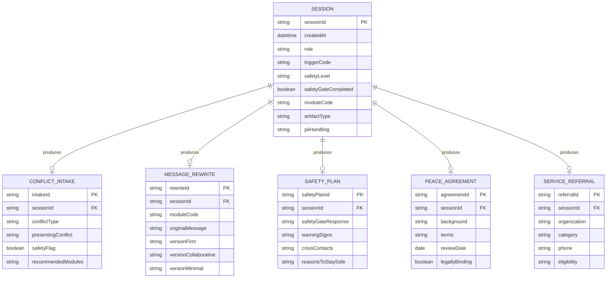

# Data Schemas

## JSON & CSV Schemas for Access To Peace Structured Outputs



---

## Schema 1 — Session Record

```json
{
  "sessionId": "string (UUID)",
  "createdAt": "ISO 8601 datetime",
  "role": "string (role code: IND, PAR, MED, etc.)",
  "triggerRaw": "string (user's original trigger text)",
  "triggerCode": "string (T-01 through T-80)",
  "safetyLevel": "string (Green | Yellow | Orange | Red)",
  "safetyGateCompleted": "boolean",
  "moduleCode": "string (MOD-01 through MOD-26)",
  "artifactType": "string (artifact code A-01 through A-13)",
  "artifactId": "string (UUID)",
  "piiHandling": "string (redacted | retained | restricted)",
  "namedVersion": "boolean",
  "draftOnly": "boolean",
  "disclaimersApplied": ["string"],
  "completedAt": "ISO 8601 datetime | null"
}
```

---

## Schema 2 — Conflict Intake Record

```json
{
  "intakeId": "string (UUID)",
  "sessionId": "string (UUID)",
  "createdAt": "ISO 8601 datetime",
  "role": "string",
  "conflictType": "string (coparenting | neighbor | workplace | school | family | community | other)",
  "partiesInvolved": [
    {
      "identifier": "string (Party A | Party B | Child | etc.)",
      "relationship": "string"
    }
  ],
  "durationEstimate": "string",
  "mostRecentIncidentDate": "string (approximate)",
  "presentingConflict": "string (neutral summary)",
  "currentImpact": "string",
  "safetyFlag": "boolean",
  "safetyNote": "string | null",
  "userStatedNeed": "string",
  "recommendedModules": ["string"]
}
```

---

## Schema 3 — Message Rewrite Record

```json
{
  "rewriteId": "string (UUID)",
  "sessionId": "string (UUID)",
  "createdAt": "ISO 8601 datetime",
  "role": "string",
  "moduleCode": "string (MOD-01 | MOD-04)",
  "originalMessage": "string",
  "relationship": "string",
  "coreNeed": "string",
  "childInvolved": "boolean",
  "courtContext": "boolean",
  "neutralityScores": {
    "accusatoryLanguage": "integer (1-10)",
    "emotionalEscalation": "integer (1-10)",
    "childCentering": "integer (1-10) | null",
    "courtReadiness": "integer (1-10) | null"
  },
  "versions": {
    "firm": "string",
    "collaborative": "string",
    "minimal": "string"
  },
  "changesNote": "string"
}
```

---

## Schema 4 — Safety Plan Record

```json
{
  "safetyPlanId": "string (UUID)",
  "sessionId": "string (UUID)",
  "createdAt": "ISO 8601 datetime",
  "role": "string",
  "safetyGateCompleted": "boolean",
  "safetyGateResponse": "string (safe | not-sure | immediate-danger)",
  "warningSigns": ["string"],
  "internalCoping": ["string"],
  "supportingPeopleAndPlaces": ["string"],
  "crisisContacts": [
    {
      "name": "string",
      "contact": "string",
      "when": "string"
    }
  ],
  "professionalSupports": [
    {
      "organization": "string",
      "contact": "string"
    }
  ],
  "environmentSafetySteps": ["string"],
  "reasonsToStaySafe": ["string"],
  "professionalReviewRequired": "boolean"
}
```

---

## Schema 5 — Peace Agreement Record

```json
{
  "agreementId": "string (UUID)",
  "sessionId": "string (UUID)",
  "createdAt": "ISO 8601 datetime",
  "facilitatorRole": "string",
  "parties": [
    {
      "identifier": "string",
      "role": "string"
    }
  ],
  "background": "string",
  "terms": [
    {
      "termNumber": "integer",
      "commitment": "string",
      "responsibleParty": "string",
      "deadline": "string | null"
    }
  ],
  "effectiveDate": "string",
  "reviewDate": "string",
  "reviewBy": "string",
  "breachProtocol": ["string"],
  "signatures": [
    {
      "party": "string",
      "signedAt": "ISO 8601 datetime | null"
    }
  ],
  "legallyBinding": false,
  "disclaimerApplied": true
}
```

---

## CSV Schema — Service Referral Export

```csv
organization_name,category,phone,website,eligibility,cost,notes,state,county,last_verified
"Legal Services of Eastern Missouri","Legal Aid","314-534-4200","lsem.org","Income-based","Free","Covers St. Louis metro","MO","St. Louis City","2024-01"
```

**Fields:**
| Field | Type | Required | Notes |
|-------|------|----------|-------|
| organization_name | string | yes | |
| category | string | yes | Legal Aid, Mental Health, DV, Housing, Youth, Elder, Mediation, Community |
| phone | string | yes | |
| website | string | no | |
| eligibility | string | yes | Income-based, Open, Referral required, etc. |
| cost | string | yes | Free, Sliding scale, Fee, Insurance |
| notes | string | no | |
| state | string | yes | 2-letter abbreviation |
| county | string | no | |
| last_verified | string | yes | YYYY-MM format |

---

## CSV Schema — Session Log Export

```csv
session_id,created_at,role,trigger_code,safety_level,module_code,artifact_type,completed_at
"abc-123","2025-01-15T10:30:00Z","PAR","T-04","Green","MOD-04","A-03","2025-01-15T10:45:00Z"
```

---

## Airtable Base Schema

See `schemas/airtable-schema.md` for the full Airtable base design including:
- Sessions table
- Conflict Intakes table
- Message Rewrites table
- Safety Plans table
- Peace Agreements table
- Service Referrals table
- User Roles table
