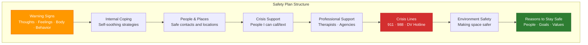
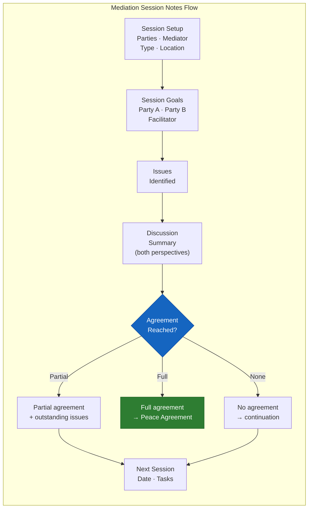
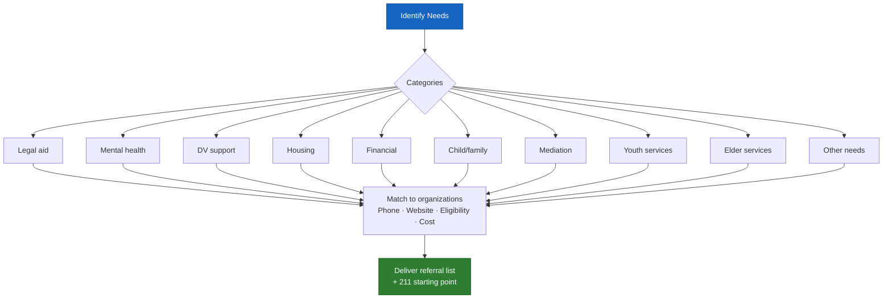

# Safety Plan Template
## Access To Peace · MOD-14 Output

---

# MY SAFETY PLAN

**Created:** _______________
**For:** _______________
**Created with support of:** _______________ (role)

---

## ⚠️ My Warning Signs

*Signs that I'm starting to struggle — in my thoughts, feelings, body, or behavior:*

1. _______________________________________________________________________________
2. _______________________________________________________________________________
3. _______________________________________________________________________________

---

## 🧘 What I Can Do On My Own

*Things I can do by myself — without calling anyone — to cope:*

1. _______________________________________________________________________________
2. _______________________________________________________________________________
3. _______________________________________________________________________________

---

## 👥 People and Places That Help

*People I can spend time with or places I can go when things are hard:*

| Person / Place | How They Help |
|----------------|--------------|
| | |
| | |

---

## 📞 People I Can Contact for Support

| Name | How to Reach | When to Reach Out |
|------|-------------|------------------|
| | | |
| | | |
| | | |

---

## 🏥 Professional Support

| Person / Organization | Contact | Notes |
|----------------------|---------|-------|
| | | |
| | | |

---

## 🆘 Crisis Lines (Always Available)

- **Emergency:** 911
- **Suicide & Crisis Lifeline:** Call or text **988**
- **National DV Hotline:** **1-800-799-7233**
- **Crisis Text Line:** Text **HOME** to **741741**

---

## 🔒 Making My Environment Safer

_______________________________________________________________________________
_______________________________________________________________________________

---

## 💙 My Reasons to Stay Safe

*The people, goals, and things that matter most to me:*

1. _______________________________________________________________________________
2. _______________________________________________________________________________
3. _______________________________________________________________________________

---

*This safety plan belongs to me. I can update it whenever I need to.*

*Access To Peace is a support tool only — not a substitute for emergency services or licensed clinical care.*

---
---

# Mediation Session Notes Template
## Access To Peace · MOD-09 / MOD-10 Output

**Date:** _______________
**Mediator / Facilitator:** _______________
**Location / Platform:** _______________
**Session type:** [ ] First session  [ ] Follow-up  [ ] Agreement session

---

## Parties Present
| Identifier | Role | Attorney Present? |
|-----------|------|-----------------|
| [Party A] | | |
| [Party B] | | |

---

## Session Goals (as stated by each party)
**Party A's goal:** _______________________________________________________________________________
**Party B's goal:** _______________________________________________________________________________
**Facilitator's goal for today:** _______________________________________________________________________________

---

## Issues Identified
1. _______________________________________________________________________________
2. _______________________________________________________________________________
3. _______________________________________________________________________________

---

## Discussion Summary (neutral — both perspectives)

**Issue 1:**
_______________________________________________________________________________

**Issue 2:**
_______________________________________________________________________________

**Issue 3:**
_______________________________________________________________________________

---

## Progress / Agreements Reached
[ ] No agreement reached — continuation planned
[ ] Partial agreement on: _______________________________________________________________________________
[ ] Full agreement reached — see attached Peace Agreement

---

## Outstanding Issues for Next Session
1. _______________________________________________________________________________
2. _______________________________________________________________________________

---

## Next Session
**Date / Time:** _______________
**Tasks before next session:**
- Party A: _______________________________________________________________________________
- Party B: _______________________________________________________________________________
- Facilitator: _______________________________________________________________________________

---

*These notes are a working document for the mediation process. They are not a legal record.*
*Access To Peace · Educational purposes only.*

---
---

# Service Referral Form Template
## Access To Peace · MOD-25 Output

**Date:** _______________
**Prepared for:** [Person A] or [role identifier]
**Prepared by:** [role]
**Location:** _______________ (city/county/state)

---

## Needs Identified

- [ ] Legal aid / attorney
- [ ] Mental health counseling
- [ ] Domestic violence support
- [ ] Housing / eviction help
- [ ] Financial assistance
- [ ] Child / family services
- [ ] Mediation / conflict resolution
- [ ] Youth services
- [ ] Elder services
- [ ] Substance use support
- [ ] Food / basic needs
- [ ] Employment / job help
- [ ] Other: _______________

---

## Referrals

| Organization | Category | Phone | Website | Cost | Notes |
|-------------|---------|-------|---------|------|-------|
| | | | | | |
| | | | | | |
| | | | | | |
| | | | | | |

---

## Start Here

**211** — Call or text **211** for any need. Free, confidential, available statewide.

---

## Crisis Lines (if applicable)

- 988 Suicide & Crisis Lifeline: call or text 988
- National DV Hotline: 1-800-799-7233
- Crisis Text Line: Text HOME to 741741

---

*Referral information is provided for educational purposes. Access To Peace does not guarantee
availability or eligibility of any service. Always call to confirm before visiting.*
