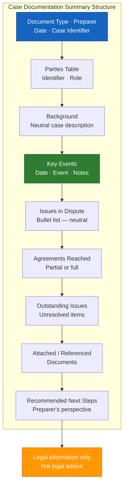

# Case Documentation Summary Template (A-11)

**Access To Peace · MOD-20 Output**

---

## CASE DOCUMENTATION SUMMARY

**Document type:** Case Documentation Summary
**Prepared by (role):** _______________
**Date prepared:** _______________
**Case identifier:** _______________

---

## Parties

| Identifier | Role |
|-----------|------|
| | |
| | |
| | |
| | |

---

## Background

*Brief, neutral description of the case. No blame. Facts only.*

_______________________________________________________________________________
_______________________________________________________________________________
_______________________________________________________________________________

---

## Key Events (Chronological)

| Date | Event | Notes |
|------|-------|-------|
| | | |
| | | |
| | | |
| | | |
| | | |

---

## Issues in Dispute

- _______________________________________________________________________________
- _______________________________________________________________________________
- _______________________________________________________________________________
- _______________________________________________________________________________

---

## Agreements Reached

*List any agreements reached, or note "None to date."*

- _______________________________________________________________________________
- _______________________________________________________________________________
- _______________________________________________________________________________

---

## Outstanding Issues

- _______________________________________________________________________________
- _______________________________________________________________________________
- _______________________________________________________________________________

---

## Attached / Referenced Documents

*List any documents attached or referenced, or note "None provided."*

- _______________________________________________________________________________
- _______________________________________________________________________________
- _______________________________________________________________________________

---

## Recommended Next Steps

*From the preparer's perspective — labeled as such.*

1. _______________________________________________________________________________

2. _______________________________________________________________________________

3. _______________________________________________________________________________

4. _______________________________________________________________________________

---

> **About This Tool**
> Access To Peace is a documentation and support tool. It is not a substitute for
> emergency services, legal advice, or licensed clinical care. Content generated
> by this platform is for informational and organizational purposes only.

> **Legal Information Only**
> This content is for educational and informational purposes only. It does not
> constitute legal advice and does not create an attorney-client relationship.
> Laws vary by state and circumstance. For legal advice specific to your situation,
> consult a licensed attorney in your jurisdiction.
>
> Missouri legal aid: Legal Services of Eastern Missouri — 314-534-4200 · lsem.org
> Missouri Bar Referral: 573-635-4128 · mobar.org

*Access To Peace · accesstopeace.org · Educational purposes only.*
