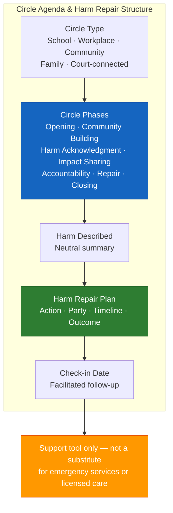

# Restorative Circle Agenda & Harm Repair Plan Template (A-06)

**Access To Peace · MOD-11 Output**

---

# PART 1 — CIRCLE AGENDA

**Circle type:** [ ] School  [ ] Workplace  [ ] Community  [ ] Family  [ ] Court-connected
**Estimated time:** _______________
**Facilitator:** _______________ (role: _______________)

---

## Harm / Conflict Being Addressed

_______________________________________________________________________________
_______________________________________________________________________________

---

## Participants

| Identifier | Role in Circle |
|-----------|---------------|
| Person(s) harmed | |
| Person(s) responsible | |
| Community member | |
| Community member | |
| Facilitator | |

---

## Circle Phases

| Phase | Time | Purpose | Sample Opening |
|-------|------|---------|---------------|
| **Opening** | ___ min | Set tone, establish safety | |
| **Community Building** | ___ min | Build trust before addressing harm | |
| **Harm Acknowledgment** | ___ min | Name what happened in neutral terms | |
| **Impact Sharing** | ___ min | Person harmed shares how they were affected | |
| **Accountability Round** | ___ min | Person responsible responds to what they heard | |
| **Repair Agreement** | ___ min | Build a concrete repair plan together | |
| **Closing** | ___ min | Affirm commitments and close the circle | |

---

## Pre-Circle Checklist

- [ ] All participants agreed to participate voluntarily
- [ ] Person responsible has acknowledged what happened
- [ ] Safety concerns assessed — no concerns present
- [ ] Facilitator has met with each participant individually before circle

---

---

# PART 2 — HARM REPAIR PLAN

**Harm described:** _______________________________________________________________________________
_______________________________________________________________________________

**Person(s) harmed:** _______________
**Person(s) responsible:** _______________

---

## Repair Actions

| Repair Action | Responsible Party | Timeline | How We'll Know It's Done |
|--------------|------------------|----------|------------------------|
| | | | |
| | | | |
| | | | |
| | | | |

---

**Check-in date:** _______________
**Facilitated by:** _______________ (role: _______________)

---

> **About This Tool**
> Access To Peace is a documentation and support tool. It is not a substitute for
> emergency services, legal advice, or licensed clinical care. Content generated
> by this platform is for informational and organizational purposes only.

> **Child Safety Notice**
> If a child is in immediate danger, call 911. To report suspected child abuse
> or neglect in Missouri, call the Missouri Children's Division Hotline:
> 1-800-392-3738 (24/7). This platform does not report to or communicate
> with child protective services.

*Access To Peace · accesstopeace.org · Educational purposes only.*
