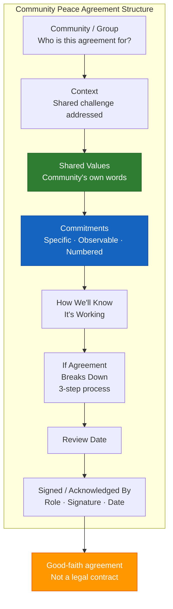

# Community Peace Agreement Template (A-13)

**Access To Peace · MOD-26 Output**

---

## COMMUNITY PEACE AGREEMENT

**Community / Group:** _______________
**Date:** _______________
**Facilitated by:** _______________ (role: _______________)

---

## Context

*Brief, neutral description of what brought this community to this agreement.*

_______________________________________________________________________________
_______________________________________________________________________________
_______________________________________________________________________________

---

## Our Shared Values

- _______________________________________________________________________________
- _______________________________________________________________________________
- _______________________________________________________________________________
- _______________________________________________________________________________
- _______________________________________________________________________________

---

## We Agree To

1. _______________________________________________________________________________

2. _______________________________________________________________________________

3. _______________________________________________________________________________

4. _______________________________________________________________________________

5. _______________________________________________________________________________

*(Add additional commitments as needed)*

---

## How We'll Know It's Working

- _______________________________________________________________________________
- _______________________________________________________________________________
- _______________________________________________________________________________

---

## If the Agreement Breaks Down

Step 1: _______________________________________________________________________________
Step 2: _______________________________________________________________________________
Step 3: _______________________________________________________________________________

---

## Review Date

_______________

---

## Signed / Acknowledged By

| Role | Signature | Date |
|------|-----------|------|
| | | |
| | | |
| | | |
| | | |
| | | |

---

> **About This Tool**
> Access To Peace is a documentation and support tool. It is not a substitute for
> emergency services, legal advice, or licensed clinical care. Content generated
> by this platform is for informational and organizational purposes only.

> **Not a Legal Contract**
> This document is a good-faith agreement for organizational purposes. It is not
> a legally binding contract unless reviewed, modified, and executed with the
> assistance of qualified legal counsel. For binding parenting plans, custody
> orders, or settlement agreements, work with a licensed attorney and file
> through the appropriate court.

*Access To Peace · accesstopeace.org · Educational purposes only.*
