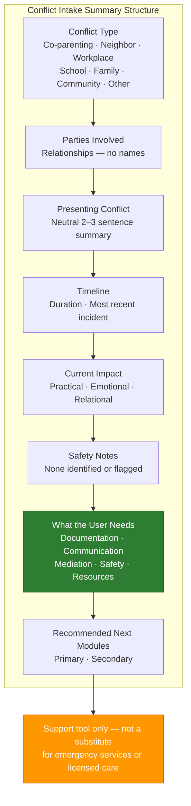

# Conflict Intake Summary Template (A-01)

**Access To Peace · MOD-05 Output**

---

## CONFLICT INTAKE SUMMARY

**Date of intake:** _______________
**Role:** _______________
**Conflict type:** [ ] Co-parenting  [ ] Neighbor  [ ] Workplace  [ ] School  [ ] Family  [ ] Community  [ ] Other: _______________

---

## Parties Involved

| Party | Relationship (no names) |
|-------|------------------------|
| Party A | |
| Party B | |
| Other (if any) | |

---

## Presenting Conflict

*Neutral, 2–3 sentence summary of what the user described. No editorializing.*

_______________________________________________________________________________
_______________________________________________________________________________
_______________________________________________________________________________

---

## Timeline

**Duration:** _______________
**Most recent incident:** _______________

_______________________________________________________________________________

---

## Current Impact

*Brief neutral summary of practical, emotional, or relational impact described by user.*

_______________________________________________________________________________
_______________________________________________________________________________

---

## Safety Notes

[ ] None identified
[ ] Safety flag present — see note:

_______________________________________________________________________________

---

## What the User Needs

- [ ] Documentation
- [ ] Advice on next steps
- [ ] Help communicating
- [ ] Help preparing for mediation
- [ ] Safety support
- [ ] Resources
- [ ] Other: _______________

---

## Recommended Next Module(s)

**Primary:** _______________________________________________________________________________

**Secondary:** _______________________________________________________________________________

---

> **About This Tool**
> Access To Peace is a documentation and support tool. It is not a substitute for
> emergency services, legal advice, or licensed clinical care. Content generated
> by this platform is for informational and organizational purposes only.

> **Child Safety Notice**
> If a child is in immediate danger, call 911. To report suspected child abuse
> or neglect in Missouri, call the Missouri Children's Division Hotline:
> 1-800-392-3738 (24/7). This platform does not report to or communicate
> with child protective services.

*Access To Peace · accesstopeace.org · Educational purposes only.*
