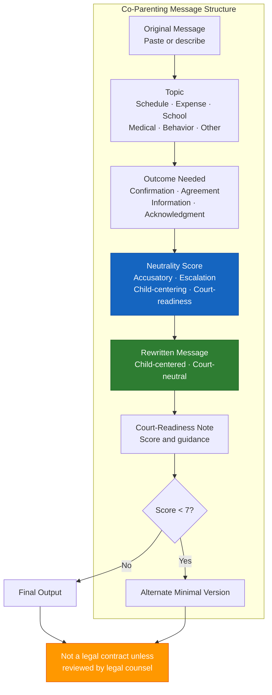

# Court-Neutral Co-Parenting Message Template (A-03)

**Access To Peace · MOD-04 Output**

---

## COURT-NEUTRAL CO-PARENTING MESSAGE

**Date:** _______________
**Role:** _______________
**Topic:** [ ] Schedule change  [ ] Expense  [ ] School  [ ] Medical  [ ] Behavior  [ ] Other: _______________
**Outcome needed:** [ ] Confirmation  [ ] Agreement  [ ] Information  [ ] Acknowledgment

---

## Original Message

*Paste or describe the original message below:*

_______________________________________________________________________________
_______________________________________________________________________________
_______________________________________________________________________________
_______________________________________________________________________________

---

## Neutrality Score

| Category | Score (1–10) | Notes |
|----------|-------------|-------|
| Accusatory language (10 = none) | /10 | |
| Emotional escalation (10 = fully calm) | /10 | |
| Child-centering (10 = fully child-focused) | /10 | |
| Court-readiness (10 = could be filed as exhibit) | /10 | |

**Overall: _____ /10**

---

## Rewritten Message

*Child-centered, court-neutral version:*

_______________________________________________________________________________
_______________________________________________________________________________
_______________________________________________________________________________
_______________________________________________________________________________
_______________________________________________________________________________

---

## Court-Readiness Note

> "This message scores _____ /10 for court-readiness.
> _______________________________________________________________________________
> _______________________________________________________________________________"

---

## Alternate Version (if original score < 7)

*Shorter, more minimal version for high-conflict situations:*

_______________________________________________________________________________
_______________________________________________________________________________
_______________________________________________________________________________

---

> **About This Tool**
> Access To Peace is a documentation and support tool. It is not a substitute for
> emergency services, legal advice, or licensed clinical care. Content generated
> by this platform is for informational and organizational purposes only.

> **Not a Legal Contract**
> This document is a good-faith agreement for organizational purposes. It is not
> a legally binding contract unless reviewed, modified, and executed with the
> assistance of qualified legal counsel. For binding parenting plans, custody
> orders, or settlement agreements, work with a licensed attorney and file
> through the appropriate court.

*Access To Peace · accesstopeace.org · Educational purposes only.*
