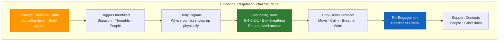

# Emotional Regulation Plan Template (A-09)

**Access To Peace · MOD-13 Output**

---

## EMOTIONAL REGULATION PLAN

**Date:** _______________
**Role:** _______________

---

## Current Emotional State (Check-In)

**Current activation level:** _____ /10

**Where it shows up in your body:**

_______________________________________________________________________________
_______________________________________________________________________________

---

## Triggers Identified

- _______________________________________________________________________________
- _______________________________________________________________________________
- _______________________________________________________________________________

---

## Body Signals

*Where do you feel the conflict or stress in your body?*

_______________________________________________________________________________
_______________________________________________________________________________

---

## Grounding Tools (Right Now — 2-5 minutes)

**5-4-3-2-1 Grounding:**
- 5 things you can see
- 4 things you can touch
- 3 things you can hear
- 2 things you can smell
- 1 thing you can taste

**Box Breathing:**
Inhale 4 counts -> Hold 4 -> Exhale 4 -> Hold 4. Repeat 4 times.

**Personalized grounding tools:**

1. _______________________________________________________________________________

2. _______________________________________________________________________________

3. _______________________________________________________________________________

4. _______________________________________________________________________________

5. _______________________________________________________________________________

---

## Cool-Down Protocol (10-30 minutes)

1. _______________________________________________________________________________

2. _______________________________________________________________________________

3. _______________________________________________________________________________

4. _______________________________________________________________________________

**Things to avoid right now:**

- _______________________________________________________________________________
- _______________________________________________________________________________
- _______________________________________________________________________________

---

## Re-Engagement Readiness Check

*Before going back into the conversation or situation, ask yourself:*

- [ ] Is my heart rate closer to normal?
- [ ] Can I describe the situation without using charged language?
- [ ] Am I able to listen without planning my rebuttal?
- [ ] Do I know what I need from this conversation?

If you can check all four: you're ready.
If not: give yourself more time. It's okay.

---

## Support Contacts

| Person / Resource | How to Reach | When to Reach Out |
|-------------------|-------------|-------------------|
| | | |
| | | |
| | | |

**Crisis Lines:**
- **Suicide & Crisis Lifeline:** Call or text **988**
- **Crisis Text Line:** Text **HOME** to **741741**

---

> **About This Tool**
> Access To Peace is a documentation and support tool. It is not a substitute for
> emergency services, legal advice, or licensed clinical care. Content generated
> by this platform is for informational and organizational purposes only.

> **Clinical Information Only**
> This content is for informational and support purposes only. It is not a
> diagnosis, treatment plan, or substitute for licensed clinical care. If you
> are experiencing a mental health crisis, contact the 988 Suicide & Crisis
> Lifeline (call or text 988) or go to your nearest emergency room.
>
> For ongoing mental health support, consult a licensed mental health professional.
> SAMHSA National Helpline: 1-800-662-4357 (free, confidential, 24/7)

*Access To Peace · accesstopeace.org · Educational purposes only.*
