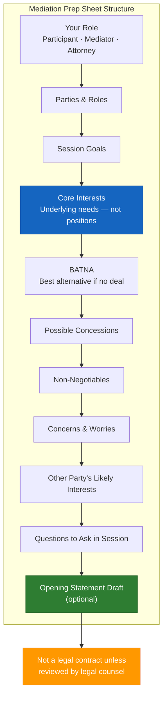

# Mediation Prep Sheet Template (A-04)

**Access To Peace · MOD-09 Output**

---

## MEDIATION PREP SHEET

**Date:** _______________
**Your role:** [ ] Participant  [ ] Mediator  [ ] Attorney representing a participant
**Conflict type:** _______________

---

## Parties and Roles

| Party | Role | Attorney Present? |
|-------|------|------------------|
| Party A | | |
| Party B | | |
| Other (if any) | | |

---

## Session Goals

*What do you want to accomplish in this session?*

1. _______________________________________________________________________________
2. _______________________________________________________________________________
3. _______________________________________________________________________________

---

## Core Interests

*What do you really need from a resolution? (underlying needs, not positions)*

1. _______________________________________________________________________________
2. _______________________________________________________________________________
3. _______________________________________________________________________________

---

## Positions to Avoid

*Positions are demands or fixed solutions. Focus on interests instead.*

1. _______________________________________________________________________________
2. _______________________________________________________________________________

---

## BATNA (Best Alternative to a Negotiated Agreement)

*What will you do if mediation fails?*

_______________________________________________________________________________
_______________________________________________________________________________

---

## Non-Negotiables

*What is absolutely non-negotiable for you?*

1. _______________________________________________________________________________
2. _______________________________________________________________________________

---

## Possible Concessions

*What are you willing to offer or be flexible on?*

1. _______________________________________________________________________________
2. _______________________________________________________________________________
3. _______________________________________________________________________________

---

## What You're Most Concerned About

_______________________________________________________________________________
_______________________________________________________________________________

---

## The Other Party's Likely Interests

*What do you think the other party needs? (framed with empathy)*

1. _______________________________________________________________________________
2. _______________________________________________________________________________

---

## Opening Statement Draft (optional)

*3–5 sentences: who you are, what you hope to accomplish, your commitment to the process. No positions stated — interests only.*

_______________________________________________________________________________
_______________________________________________________________________________
_______________________________________________________________________________
_______________________________________________________________________________
_______________________________________________________________________________

---

## Questions to Ask in Session

- "What matters most to you in this situation?"
- "What would a successful outcome look like for you?"
- "What has prevented resolution so far, from your perspective?"
- _______________________________________________________________________________
- _______________________________________________________________________________

---

> **About This Tool**
> Access To Peace is a documentation and support tool. It is not a substitute for
> emergency services, legal advice, or licensed clinical care. Content generated
> by this platform is for informational and organizational purposes only.

> **Not a Legal Contract**
> This document is a good-faith agreement for organizational purposes. It is not
> a legally binding contract unless reviewed, modified, and executed with the
> assistance of qualified legal counsel. For binding parenting plans, custody
> orders, or settlement agreements, work with a licensed attorney and file
> through the appropriate court.

*Access To Peace · accesstopeace.org · Educational purposes only.*
