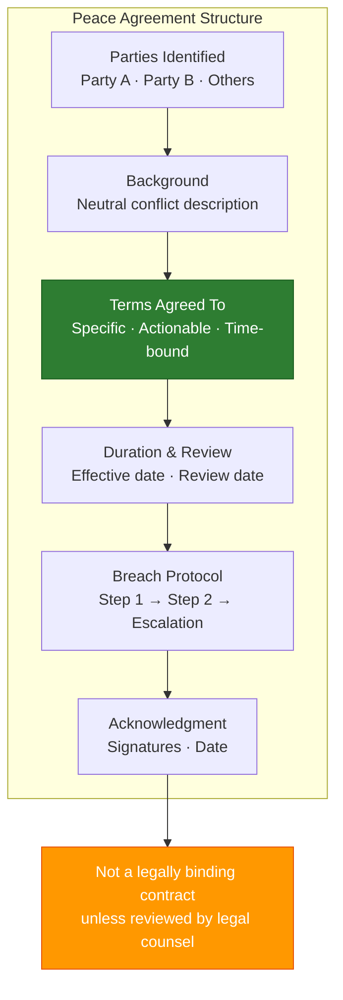

# Peace Agreement Template

**Access To Peace · MOD-10 Output**

---

## PEACE AGREEMENT

**Date:** _______________
**Facilitated by:** _______________ (role: _______________)
**Location / Context:** _______________

---

## Parties

| Party | Name / Identifier | Role in Conflict |
|-------|------------------|-----------------|
| Party A | | |
| Party B | | |
| Other (if any) | | |

---

## Background

*Brief, neutral description of the conflict that led to this agreement. No blame. Facts only.*

_______________________________________________________________________________
_______________________________________________________________________________

---

## What We Agree To

*List specific, actionable, time-bound commitments. Each item should be clear enough that both parties know when it has been kept.*

1. _______________________________________________________________________________

2. _______________________________________________________________________________

3. _______________________________________________________________________________

4. _______________________________________________________________________________

5. _______________________________________________________________________________

*(Add additional items as needed)*

---

## Duration & Review

This agreement is effective: _______________
We will review this agreement on: _______________
Review will be conducted by: _______________

---

## If This Agreement Is Not Kept

If either party believes the agreement has not been honored:

Step 1: _______________________________________________________________________________
Step 2: _______________________________________________________________________________
Step 3 (escalation): _______________________________________________________________________________

---

## Acknowledgment

By signing below, each party acknowledges they have read, understood, and agreed to the
terms above. This agreement is entered into voluntarily.

| Party | Signature | Date |
|-------|-----------|------|
| Party A | | |
| Party B | | |
| Facilitator (if applicable) | | |
| Witness (if applicable) | | |

---

*This document is a good-faith agreement for organizational purposes. It is not a legally
binding contract unless reviewed and executed with the assistance of qualified legal counsel.*

*Access To Peace · accesstopeace.org · Educational purposes only.*
