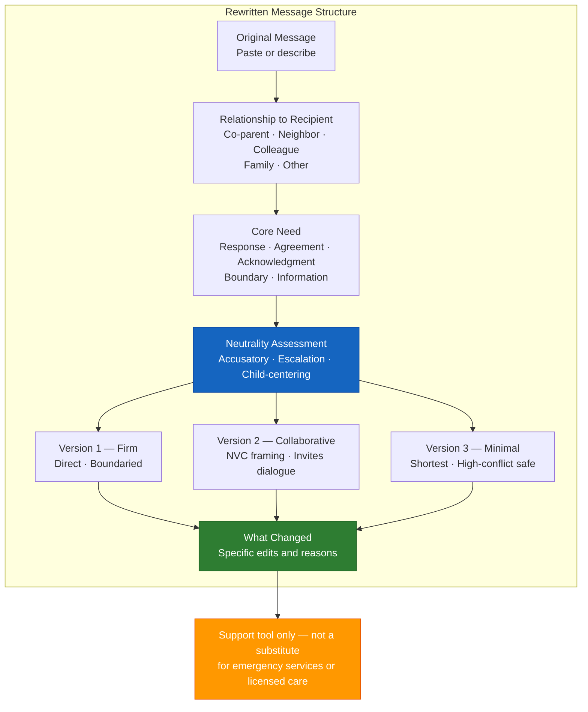

# Rewritten Message Template (A-02)

**Access To Peace · MOD-01 Output**

---

## REWRITTEN MESSAGE

**Date:** _______________
**Role:** _______________
**Relationship to recipient:** _______________
**Core need:** [ ] Response  [ ] Agreement  [ ] Acknowledgment  [ ] Boundary  [ ] Information

---

## Original Message

*Paste or describe the original message below:*

_______________________________________________________________________________
_______________________________________________________________________________
_______________________________________________________________________________
_______________________________________________________________________________

---

## Neutrality Assessment

| Category | Score (1–10) | Notes |
|----------|-------------|-------|
| Accusatory language (10 = none) | /10 | |
| Emotional escalation (10 = fully calm) | /10 | |
| Child-centering (10 = fully child-centered, or N/A) | /10 | |

---

## Version 1 — Firm

*Clear, direct, boundaried. Non-negotiable points preserved. No emotional escalation.*

_______________________________________________________________________________
_______________________________________________________________________________
_______________________________________________________________________________
_______________________________________________________________________________

---

## Version 2 — Collaborative

*Opens dialogue. Uses NVC framing. Invites response.*

_______________________________________________________________________________
_______________________________________________________________________________
_______________________________________________________________________________
_______________________________________________________________________________

---

## Version 3 — Minimal

*Shortest version that communicates the core need. Good for high-conflict situations.*

_______________________________________________________________________________
_______________________________________________________________________________

---

## What Changed

*Brief bullet list: specific changes made and why.*

- _______________________________________________________________________________
- _______________________________________________________________________________
- _______________________________________________________________________________
- _______________________________________________________________________________

---

> **About This Tool**
> Access To Peace is a documentation and support tool. It is not a substitute for
> emergency services, legal advice, or licensed clinical care. Content generated
> by this platform is for informational and organizational purposes only.

*Access To Peace · accesstopeace.org · Educational purposes only.*
