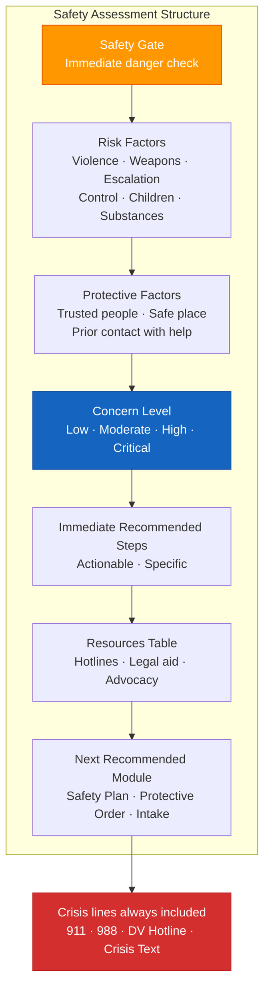

# Safety Assessment Template (A-07)

**Access To Peace · MOD-07 Output**

---

## SAFETY ASSESSMENT

**Date:** _______________
**Role:** _______________
**Safety gate response:** [ ] Safe  [ ] Not sure  [ ] Immediate concern

---

## Risk Factors Identified

*Check all that apply. Answer only what you are comfortable sharing.*

- [ ] _______________________________________________________________________________
- [ ] _______________________________________________________________________________
- [ ] _______________________________________________________________________________
- [ ] _______________________________________________________________________________
- [ ] _______________________________________________________________________________

---

## Protective Factors Present

- [ ] _______________________________________________________________________________
- [ ] _______________________________________________________________________________
- [ ] _______________________________________________________________________________
- [ ] _______________________________________________________________________________

---

## Overall Safety Concern Level

[ ] Low  [ ] Moderate  [ ] High  [ ] Critical

---

## Immediate Recommended Steps

1. _______________________________________________________________________________

2. _______________________________________________________________________________

3. _______________________________________________________________________________

4. _______________________________________________________________________________

---

## Resources

| Resource | Contact | Best For |
|----------|---------|----------|
| | | |
| | | |
| | | |
| | | |
| | | |

---

## Crisis Lines (Always Available)

- **Emergency:** 911
- **Suicide & Crisis Lifeline:** Call or text **988**
- **National DV Hotline:** **1-800-799-7233**
- **Crisis Text Line:** Text **HOME** to **741741**

---

## Next Recommended Module

_______________________________________________________________________________

---

> **About This Tool**
> Access To Peace is a documentation and support tool. It is not a substitute for
> emergency services, legal advice, or licensed clinical care. Content generated
> by this platform is for informational and organizational purposes only.

> **Clinical Information Only**
> This content is for informational and support purposes only. It is not a
> diagnosis, treatment plan, or substitute for licensed clinical care. If you
> are experiencing a mental health crisis, contact the 988 Suicide & Crisis
> Lifeline (call or text 988) or go to your nearest emergency room.
>
> For ongoing mental health support, consult a licensed mental health professional.
> SAMHSA National Helpline: 1-800-662-4357 (free, confidential, 24/7)

> **Safety Resources**
> If you are in immediate danger, call 911.
> National Domestic Violence Hotline: 1-800-799-7233 (24/7) · thehotline.org
> 988 Suicide & Crisis Lifeline: Call or text 988
> Crisis Text Line: Text HOME to 741741
>
> Protective order laws and processes vary by state. The information in this
> document is educational only. Consult a licensed attorney or victim advocate
> for guidance specific to your situation.

> **Child Safety Notice**
> If a child is in immediate danger, call 911. To report suspected child abuse
> or neglect in Missouri, call the Missouri Children's Division Hotline:
> 1-800-392-3738 (24/7). This platform does not report to or communicate
> with child protective services.

*Access To Peace · accesstopeace.org · Educational purposes only.*
