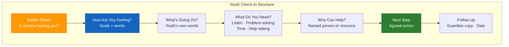

# Youth Emotional Check-In Summary Template (A-12)

**Access To Peace · MOD-23 Output**

---

## YOUTH EMOTIONAL CHECK-IN SUMMARY

**Date:** _______________
**Student identifier:** _______________
**Facilitated by:** _______________

---

## How Are You Feeling?

**Scale:** _____ /10

**In your words:** [ ] Good  [ ] Okay  [ ] Not great  [ ] Really bad  [ ] Frustrated  [ ] Scared  [ ] Confused

_______________________________________________________________________________

---

## What's Going On?

*Your own words — no pressure to share everything.*

_______________________________________________________________________________
_______________________________________________________________________________

---

## What Do You Need Most Right Now?

[ ] Someone to listen
[ ] Help solving a problem
[ ] Time alone
[ ] Help talking to someone
[ ] I'm not sure

---

## Support Identified

*Who can you talk to?*

_______________________________________________________________________________

---

## Next Step

_______________________________________________________________________________

---

## Guardian Copy Requested

[ ] Yes  [ ] No — youth's choice

---

## Follow-Up Scheduled

_______________________________________________________________________________

---

> **About This Tool**
> Access To Peace is a documentation and support tool. It is not a substitute for
> emergency services, legal advice, or licensed clinical care. Content generated
> by this platform is for informational and organizational purposes only.

> **For Young People**
> This tool is designed to support you, not get you in trouble. What you share
> here is used only to help you. If you're in danger, please tell a trusted
> adult or call 988. A simplified summary of this document can be shared with
> a parent, guardian, or school counselor — but only if you choose to share it.

*Access To Peace · accesstopeace.org · Educational purposes only.*
