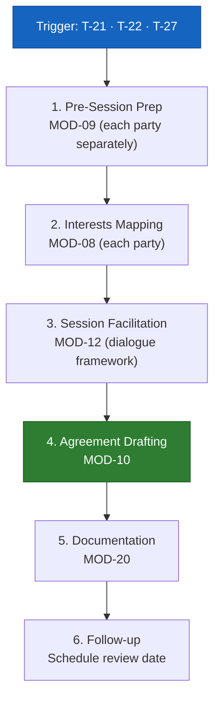
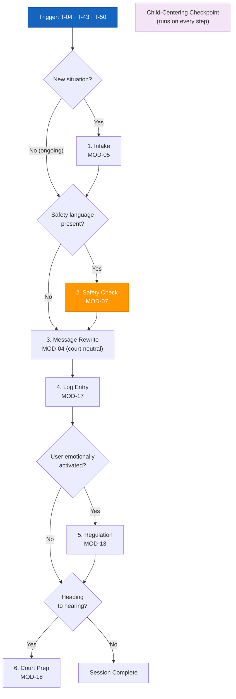
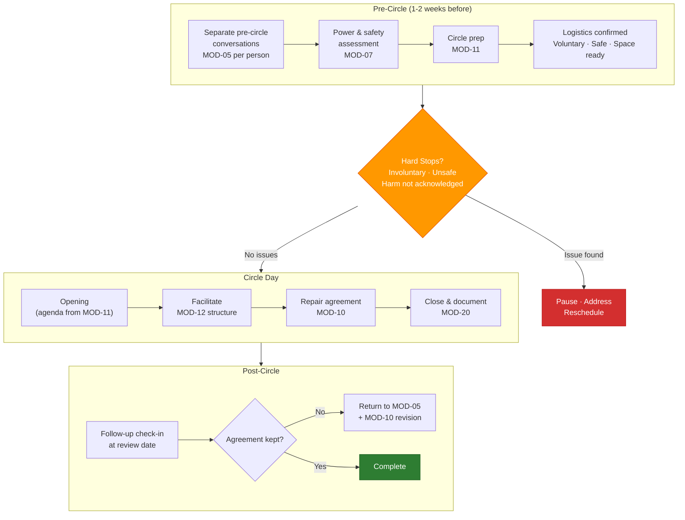
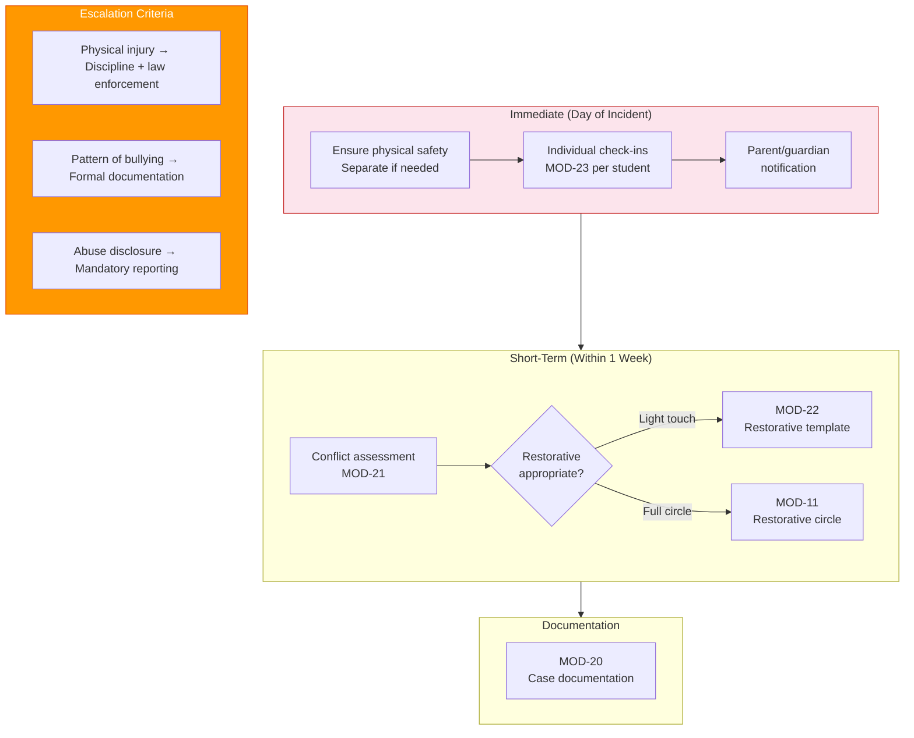
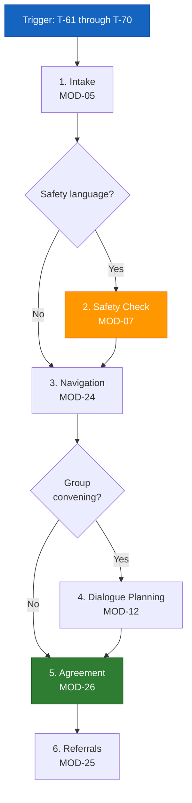
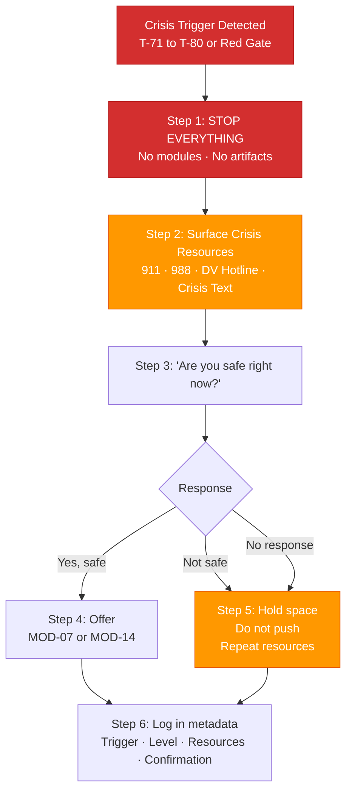

# Mediation Session Workflow
## Workflow: MED-SESSION
**For:** Mediator (MED), Arbitrator (ARB), Attorney (ATT) in mediation context  
**Start trigger:** T-21, T-22, T-27  

## Steps
1. **Pre-session prep** → MOD-09 (for each party separately if mediating)
2. **Interests mapping** → MOD-08 (pre-session for each party)
3. **Session facilitation** → MOD-12 (community dialogue framework adapted for mediation)
4. **Agreement drafting** → MOD-10
5. **Documentation** → MOD-20
6. **Follow-up** → Schedule review date from MOD-10 output

## Key Guardrails for Mediator Role
- Never produce content that advocates for one party over another
- Both parties' interests must appear in session notes
- Agreement terms reviewed for specificity before finalizing (MOD-10 quality gate)

---

# Co-Parenting Communication Workflow
## Workflow: COPAR-COMM
**For:** Parent (PAR), Attorney (ATT), GAL  
**Start trigger:** T-04, T-43, T-50  

## Steps
1. **Intake** → MOD-05 (if new situation) or skip to Step 2 (if ongoing)
2. **Safety check** → MOD-07 if any safety language present
3. **Message rewrite** → MOD-04 (court-neutral co-parenting rewriter)
4. **Log entry** → MOD-17 (add to communication log)
5. **Regulation** → MOD-13 if user is emotionally activated before or after
6. **Escalation** → MOD-18 (court prep) if situation is heading to hearing

## Child-Centering Checkpoint (runs on every step)
Every output must pass: *"Does this serve the child's best interest?"*
If not — revise before producing.

---

# Restorative Circle Workflow
## Workflow: RESTORATIVE-CIRCLE
**For:** RPF, SCL, TCH, ORG  
**Start trigger:** T-24, T-25, T-56  

## Pre-Circle (1–2 weeks before)
1. **Separate pre-circle conversations** with each participant → MOD-05 per person
2. **Power & safety assessment** → MOD-07 (confirm circle is appropriate)
3. **Circle prep** → MOD-11 (agenda + harm repair plan)
4. **Logistics confirmed:** space, time, voluntary participation, no active safety threat

## Circle Day
1. Opening — use agenda from MOD-11
2. Facilitate using community dialogue structure → MOD-12
3. Repair agreement → MOD-10 (populated during circle)
4. Close and document → MOD-20

## Post-Circle
1. Follow-up check-in at [review date from MOD-11]
2. If agreement not kept → return to MOD-05 + MOD-10 revision

## Hard Stops
- Circle does not proceed if: participant attendance is involuntary, safety concern unresolved, or harm has not been acknowledged
- If any of these: pause, address, reschedule

---

# School Conflict Response Workflow
## Workflow: SCHOOL-CONFLICT
**For:** SCL, TCH  
**Start trigger:** T-51, T-52, T-53, T-56, T-59  

## Immediate (Day of Incident)
1. Ensure physical safety — separate if needed
2. Individual check-ins → MOD-23 (youth check-in) for each student
3. Parent/guardian notification (document via MOD-17 format)

## Short-Term (Within 1 Week)
4. Conflict assessment → MOD-21 (peer conflict resolution guide)
5. If restorative practice appropriate → MOD-22 (school restorative template)
6. If restorative circle needed → MOD-11

## Documentation
7. MOD-20 (case documentation summary) for any formal record

## Escalation Criteria
- Physical injury → school discipline + possible law enforcement
- Pattern of bullying → formal bullying documentation + parent conference
- Disclosure of abuse → mandatory reporting (separate from this workflow)

---

# Community Dispute Workflow
## Workflow: COMMUNITY-DISPUTE
**For:** ORG, NCM, MED  
**Start trigger:** T-61 through T-70  

## Steps
1. **Intake** → MOD-05 (from community member's perspective)
2. **Safety check** → MOD-07 if safety language present
3. **Navigation** → MOD-24 (neighborhood dispute navigator)
4. **Dialogue planning** → MOD-12 (if group convening)
5. **Agreement** → MOD-26 (community peace agreement)
6. **Referrals** → MOD-25 (if any party needs services)

---

# Crisis Response Workflow
## Workflow: CRISIS-RESPONSE
**For:** All roles  
**Start trigger:** Any T-71 through T-80, or any Red safety gate  

## This workflow overrides all other workflows.

### Step 1 — Stop everything.
No module work. No artifacts. Crisis first.

### Step 2 — Surface crisis resources immediately.

> 🆘 Emergency: **Call 911**
> 💙 Suicide & Crisis Lifeline: **Call or text 988**
> 💜 National DV Hotline: **1-800-799-7233**
> 💬 Crisis Text Line: **Text HOME to 741741**

### Step 3 — Ask one question only.
> "Are you safe right now?"

### Step 4 — If safe: offer to continue with MOD-07 or MOD-14.
### Step 5 — If not safe: hold space. Do not push. Repeat resources.
### Step 6 — Do not resume any other workflow until user confirms they are safe.

## Logging
All crisis interrupts are logged in session metadata with:
- Trigger code
- Safety level (Red)
- Crisis resources surfaced (yes)
- User safety confirmation (pending / confirmed / not confirmed)
