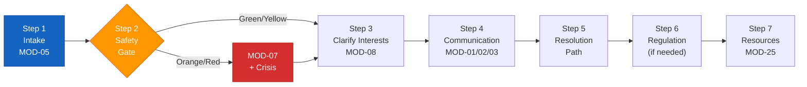
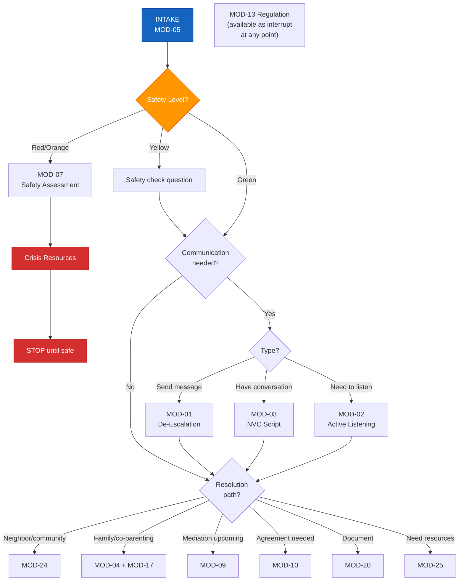

# Individual Conflict Navigation Workflow

## Workflow: IND-CONFLICT-NAV
**For:** Individual (IND) with no professional representation  
**Start trigger:** Any T-11 through T-20 conflict trigger  
**Estimated time:** 20–45 minutes

---

## Steps

### Step 1 — Intake (MOD-05)
- Complete conflict intake question set
- Identify safety level
- Identify conflict type and parties

### Step 2 — Safety Gate
- If Orange/Red → route to MOD-07 + crisis resources first
- If Green/Yellow → continue

### Step 3 — Clarify Interests (MOD-08)
- Map positions vs. interests
- Identify BATNA
- Identify non-negotiables

### Step 4 — Communication (MOD-01 or MOD-03)
- If user needs to send a message → MOD-01
- If user needs to have a conversation → MOD-03 (NVC script)
- If user needs to listen → MOD-02

### Step 5 — Resolution Path
Based on conflict type:
- **Neighbor/community** → MOD-24
- **Family/co-parenting** → MOD-04 + MOD-17
- **Mediation upcoming** → MOD-09
- **Agreement needed** → MOD-10

### Step 6 — Regulation Support (if needed)
If user is emotionally activated at any point → interrupt with MOD-13

### Step 7 — Resources
Close every session with MOD-25 if user needs external support

---

## Decision Tree

